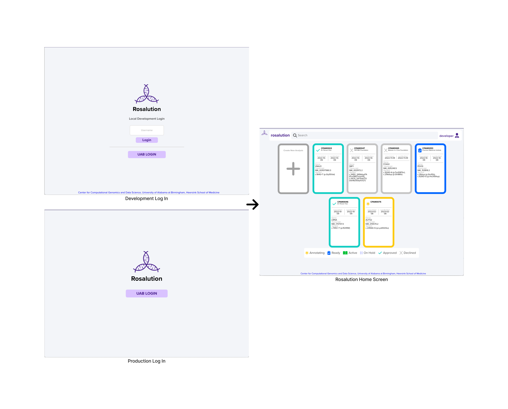
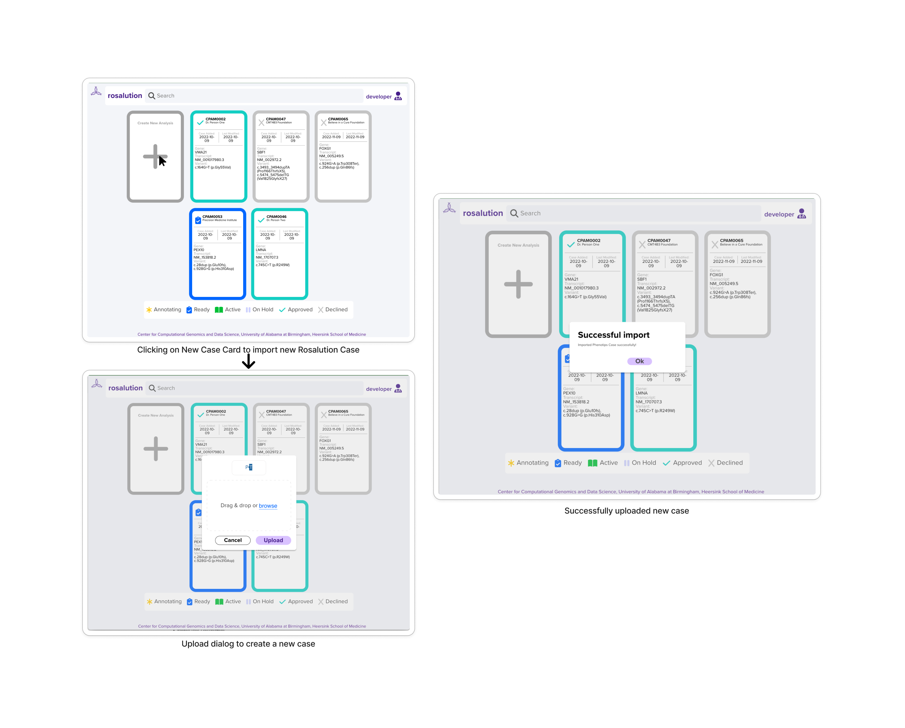

# Rosalution

<p align="center">
    
</p>


[](CODE_OF_CONDUCT.md)

[Getting Started](#getting-started) • [Deployment and Usage](#deployment-and-usage)•
[Testing & Static Analysis](#testing-and-static-analysis) • [Contributing](#contributing) •
[Maintainers](#maintainers) • [Credits and Acknowledgements](#credits-and-acknowledgements) • [License](#license)

Rosalution assists researchers in studying genetic variation 🧬 in patients 🧑🏾‍🤝‍🧑🏼 by
helping select candidate animal models 🐀🐁🐠🪱 to replicate the variation to
further research to derive, diagnose, and provide therapies for ultra-rare diseases.

Rosalution is the open-source web application maintained and developed by the
[University of Alabama at Birmingham (UAB) Center for Computational Genomics and Data Science (CGDS)](https://sites.uab.edu/cgds/)
to support not only the current [UAB Center for Precision Animal Modeling (C-PAM)](https://sites.uab.edu/cpam/) process,
but also data collection, QA/QC, standardization, integration, dissemination, and collaboration. It also forces and
collects decision points made during the process. The data collected can be mined for process improvement as well as
generation of biological insights. This effort to consolidate both the process and the data is critical; this process
shift is needed to reduce the costs and increase the throughput of precision modeling projects in general.

Rosalution supports three significant aspects of this collaborative animal modeling process.

- ⌨️ configurable case annotation of genes/loci and variants with patient data intake and public 'omics datasets
- ✨ dissemination of data to a large team of interdisciplinary researchers and physicians
- 🌐 collaborative team review and analysis of the case


---

## Getting Started

- [Prerequisites](#prerequisites)
- [Browser Support](#browser-support)
- [Local Development Setup](#local-development-setup)
    - [Clone Repository](#clone-repository)
    - [Environment Setup](#environment-setup)

### Prerequisites

The following pre-requisites are required to be installed in the target *NIX environment for
deploying and testing Rosalution. Install environment dependencies below using
the respective installation instructions for your target environment.

- [Node.JS 16+](https://nodejs.org/en/)
    - Node.JS recommends managing Node.JS installations with [nvm](https://www.npmjs.com/package/npx) - [install](https://github.com/nvm-sh/nvm#install--update-script)
- [Python 3.8+](https://www.python.org/) - [Install](https://www.python.org/downloads/)
    - Utilizes pip to install in the virtual environment setup and needs to be available in your path
- [Git](https://git-scm.com/)
    - Setup with your favorite git client. Here is a [GitHub Guide](https://github.com/git-guides/install-git)
    for different platforms.
- [Docker 17.12.0+](https://www.docker.com/) with `docker-compose` CLI or `docker compose` from Docker Desktop - [Install](https://www.docker.com/)
    - **Docker Compose** is used for local deployments of the application. The `docker-compose`
    tool is fully integrated within the **Docker Desktop** suite now. For new users of **Docker**
    it is easier to get started with **Docker Desktop**. From the official [Docker documentation](https://docs.docker.com/compose/compose-v2/),
    "[`docker compose`] is expected to be a drop-in replacement for `docker-compose`".
    - Installing and running **Docker** requires sudo/admin privileges in the target environment
- **sudo/Admin environment privileges**
    - The `setup.sh` script requires sudo/admin privileges in the target development environment to update the
    `/etc/hosts` file to setup localhost redirection for a Rosalution deployment

### Browser Support

| Chrome | Firefox |
| ------ | ------- |
| 64+    | 86+     |

### Local Development Setup

Clone the Git repository [from GitHub](https://github.com/uab-cgds-worthey/rosalution) locally.

#### Clone Repository

```bash
git clone https://github.com/uab-cgds-worthey/rosalution.git
cd rosalution
```

#### Environment Setup

`setup.sh` provisions your local environment for developing Rosalution.
The script will

- `yarn install` within each subdirectory
- Updates your local `/etc/hosts` to support the local DNS redirect of localhost to 'local.rosalution.cgds'.
- Creates a Python virtual environment for called **"rosalution_env"** within the backend directory
- Installs Python dependencies within the virtual environment

```bash
./setup.sh
```

**For Windows Subsystem Linux users updating their `/etc/hosts` in WSL2**

> The `/etc/hosts` file must manually update on the Windows side located in
`C:\Windows\System32\drivers\etc` as an administrator.  Then restart the Linux
Subsystem by running the following in PowerShell as an administrator

```powershell
Restart-Service LxssManager*
```

---

## Deployment and Usage

- [Deploying with Docker Compose](#deploying-with-docker-compose)
- [Login and Access](#login-and-access)
    - [Authentication](#authentication)
    - [Users and User Types](#users-and-user-types)
- [Adding Users](#adding-users)
- [Database](#database)
    - [Fixtures](#fixtures)
    - [Seeding the Database](#seeding-the-database)
    - [Interacting with the Database](#interacting-with-the-database)
- [Production](#production)
    - [Using the Build Script](#using-the-build-script)
    - [Local Deployment of a Production Build](#local-deployment-of-a-production-build)

### Deploying With Docker Compose

Deploy Rosalution from the project's root directory using `docker compose`.
Be sure that `./setup.sh` has been run recently for any recent dependency updates
to be installed in all of the subdirectories.

```bash
# deploy rosalution services within this session
docker compose up

# deploy services in the background using the `-d` option
docker compose up --build -d

# force docker images to re-build using the `--build` option
docker compose up --build
```

### Login and Access

To log in to the system once it has been locally deployed, enter a username in the designated field and click the
 "Login" button as seen in the figure below.

#### Authentication

The method of authentication for the Rosalution system may vary depending on the deployment environment. In a local
 development environment, the system utilizes OAuth2 for issuing login tokens. This allows for a streamlined development
 experience and faster iteration.

In contrast, in a production environment, the system utilizes CAS (Central Authentication Service) for authentication.
 This means that in order to log in to the production environment, a valid username must be provided, and an OAuth2
 token will be issued if the username is valid in the system.

#### Users and User Types

A list of all users in the system is available in `etc/fixtures/initial-seed/users.json`.
User permissions according to a type of user is planned to become available in an upcoming update.

👩‍💻 The following table lists some of the usernames and their corresponding user types:

| Username | Type of User
|:--------:|:-------------:
|developer | Developer user
|researcher | Researcher user
|user01 | System Testing user
|user04 | Pre-clinical-intake user
|user07 | Bioinformatics-section user



### Adding New Analyses

Users can create new cases on Rosalution by clicking on the '+' card to add a new case, as shown in the below figures.
Doing so prompts an upload dialog to import files to create a new Rosalution case. These files must be in .json format.
Once uploaded, a 'Successful import' dialog displays.
Refresh the page to see the newly imported case on the Rosalution dashboard.

To refer how to format your .json files to upload as new cases, refer to the example cases .json files in `./etc/fixtures/import/`.



### Adding Users

To add a new user to the system, you must first define the user in the same format as the users in the
`example-adding-users.json` file in the `etc/fixtures` directory.

Then, you must run the following command from the root directory of the project:

```bash
docker-compose exec -T rosalution-db mongosh /tmp/fixtures/add_user.js
```

Usage information on optional arguments for the [add_user.js](./etc/fixtures/add_user.js) script is available by
 running the following command:

```bash
docker-compose exec -T rosalution-db mongosh --eval "var help=true;" /tmp/fixtures/add_user.js
```

### Database

Rosalution uses MongoDB to store the state of the application.

#### Fixtures

MongoDB database fixtures are located in the `<project-root>/etc/fixtures` directory.
The **initial-db-seed.sh** script and **./etc/fixtures/** directory are mounted as
volumes into the database container for use to seed the database.

```yml
rosalution-db:
image: mongo:5.0.9
volumes:
    - ./etc/fixtures/initial-seed/initial-db-seed.sh:/docker-entrypoint-initdb.d/initial-db-seed.sh
    - ./etc/fixtures/:/tmp/fixtures
```

#### Seeding the Database

The MongoDB DB is initially seeded at the time of container startup using the
`/docker-entrypoint-initdb.d/initial-db-seed.sh` script.

> Visit
[MongoDB Initializing a fresh instance](https://hub.docker.com/_/mongo/) for
more information on `/docker-entrypoint-initdb.d` executing scripts at the time
of startup.

When automated testing, Cypress re-seeds the database using the `./etc/fixtures/seed.js` script to
reset Rosalution's state.  The script is executed within the MongoDB database
container with `docker compose exec`.

```bash
docker compose exec rosalution-db  mongosh /tmp/fixtures/seed.js
```

#### Interacting with the Database

Use the following command to view the database within the MongoDB container.

```bash
docker exec -it rosalution_rosalution-db_1 mongosh rosalution_db
```

### Production

#### Using the Build Script

When deploying the Rosalution system in a production environment, it is important to ensure that the build is optimized
 for security. This can be achieved by using the [`build.sh`](./build.sh) script.

The `build.sh` script is a command-line tool that can be used to build the Rosalution system for a production
 environment. The script accepts various command-line arguments that can be used to customize the build process.

The script also includes several functions that are used to parse the build configuration file, construct build
arguments, and build the necessary images. It also includes a function to push the built images to their respective
repositories.

Note: The Docker images built by the `build.sh` script can only be published by Rosalution maintainers to our private
registry.

For additional information on the `build.sh` script, refer to the [build.sh script documentation](./build.sh) within the
 script itself.

#### Local deployment of a Production Build

To deploy a production build locally, the following command can be uses.

```bash
docker-compose -f docker-compose.local-production.yml up --build
```

 This command uses the `docker-compose` tool to build and run the necessary containers for the production
 environment, as specified in the `docker-compose.local-production.yml` file. The `-f` flag is used to specify the
 compose file to use, in this case `docker-compose.local-production.yml` and `--build` flag is used to force Docker
 Compose to rebuild the images.

#### Accessing A Locally Deployed Rosalution

To access the locally deployed Rosalution application after running `docker compose up`,
visit the [http://local.rosalution.cgds/rosalution/](http://local.rosalution.cgds/rosalution/) URL in your browser.

---

## Testing and Static Analysis

- [Unit and Integration Testing](#unit-and-integration-testing)
- [System Testing](#system-testing)
- [Static Analysis](#static-analysis)

### Unit and Integration Testing

Rosalution's entire stack is supported with thorough testing. Review the following important notes
below before getting started with running and developing tests.

- ✔️ Dependencies in your environment must be installed as listed in
[#Getting Started##Prerequisites](#prerequisites)
- ✔️ Your local environment must [successfully setup with setup.sh](#environment-setup)
in order to run testing
- 📁 Tests **must** be executed within their respective sub-directories
- 🐍 Python unit tests and linting must run within the activated python virtual environment
    - `source backend/rosalution_env/bin/activate`

Refer to the following READMEs for details on running tests and code coverage for
the Rosalution's backend and frontend.

- [Frontend Testing & Code Coverage](./frontend/README.md#testing)
- [Backend Testing & Code Coverage](./backend/README.md#testing)

### System Testing

- [Full Stack System Testing](./system-tests/README.md)

System testing requires the entire stack of the application to be successfully
deployed to your local development environment. The environment must be setup
and the application deployed with *docker compose*. Refer to the following
for a quick start with System Testing done by Cypress.

Our system testing requires that Chrome is available as a browser on the system.
This makes it extremely difficult to setup/run within Windows Subsystem Linux,
so running system testing in WSL2 is not supported.

```bash
# Run System Testing with report displayed in terminal
cd system-tests
yarn test:e2e
```

```bash
# Run System Testing with Cypress UI to visualize and run system testing
cd system-tests
yarn test:e2e:open
```

### Static Analysis

We use linting tools for JavaScript, Python, Docker, Markdown, and Shell scripts for static analysis.

To see the commands and how to run linting,
refer to [Linting and Static Analysis](CONTRIBUTING.md#linting-and-static-analysis) in the
[Contributing Guidelines](CONTRIBUTING.md).

---

## Contributing

- [Contributing Guidelines](#contributing-guidelines)
- [Code of Conduct](#code-of-conduct)
- [How to Report a Bug](#how-to-report-a-bug)

### Contributing Guidelines

We welcome contributions from the community! Please read our
 [🎇Contributing Guidelines](CONTRIBUTING.md)
to learn how you can help improve the project.

### Code of Conduct

We expect all contributors to adhere to our
 [📋code of conduct](CODE_OF_CONDUCT.md). Please read it before
 contributing to the project.

### How to Report a Bug

To report a bug, refer to [🐞Reporting Issues](CONTRIBUTING.md#reporting-issues)
 in the [🎇Contributing Guidelines](CONTRIBUTING.md).

---

## Maintainers

- [Angelina Uno-Antonison](https://github.com/SeriousHorncat)
    - Email: aeunoantonison@uabmc.edu
- [Rabab Fatima](https://github.com/fatimarabab)
- [James Scherer](https://github.com/JmScherer)
- [Alex Moss](https://github.com/kuthedk)

---

## Credits and Acknowledgements

**Elizabeth Worthey, Ph.D.**  
*Principal Investigator*, *Director*,
[Center for Computational Genomics and Data Science (CGDS)](https://sites.uab.edu/cgds/)  
*Co-Director*,
[Center for Precision Animal Modeling - Bioinformatics Section](https://sites.uab.edu/cpam/bis/)  
Heersink School of Medicine, The University of Alabama at Birmingham, Birmingham, AL

**[Center for Computational Genomics and Data Science (CGDS)](https://sites.uab.edu/cgds/)**  
Department of Genetics  
Heersink School of Medicine, The University of Alabama at Birmingham, Birmingham, AL

**[Center for Precision Animal Modeling (C-PAM)](https://sites.uab.edu/cpam/)**  
 The University of Alabama at Birmingham, Birmingham, AL

**Brittany Lasseigne, Ph.D.**  
*Principal Investigator*, *Assistant Professor*, [Lasseigne Lab](https://www.lasseigne.org/)  
Department of Cell, Developmental and Integrative Biology  
*Co-Director*, [Center for Precision Animal Modeling - Bioinformatics Section](https://sites.uab.edu/cpam/bis/)  
Heersink School of Medicine, The University of Alabama at Birmingham, Birmingham, AL

**[Bioinformatics Section(BIS) in the Center for Precision Animal Modeling (C-PAM)](https://sites.uab.edu/cpam/bis)**  
 The University of Alabama at Birmingham, Birmingham, AL

---

## License

Rosalution is licensed under the [GNU General Public License v3.0](COPYING).
