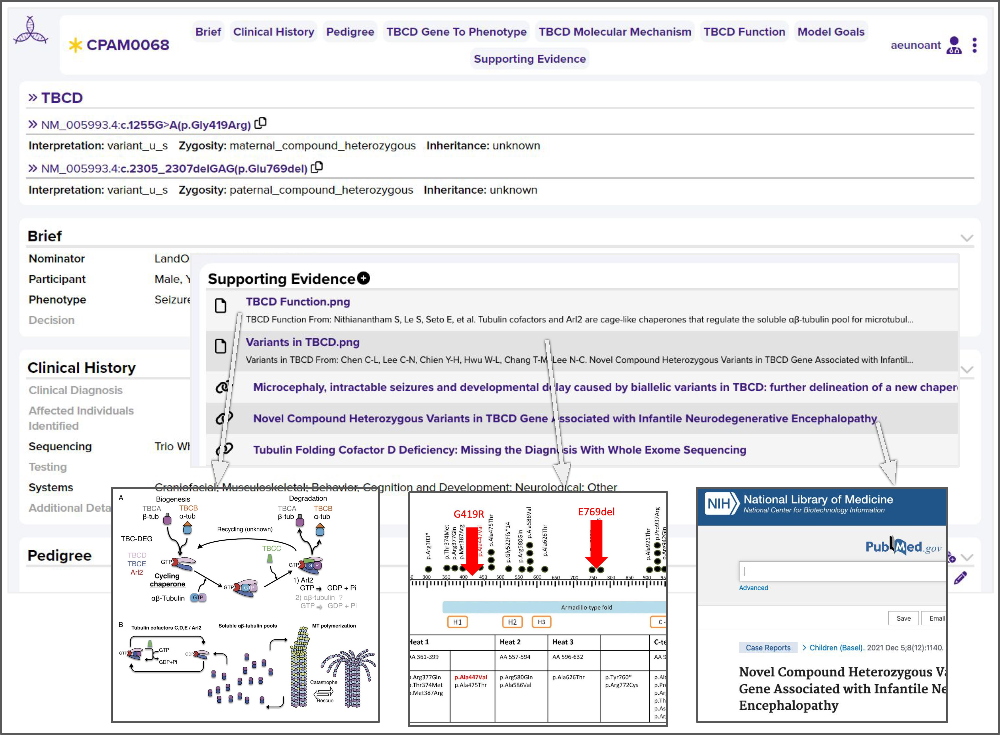
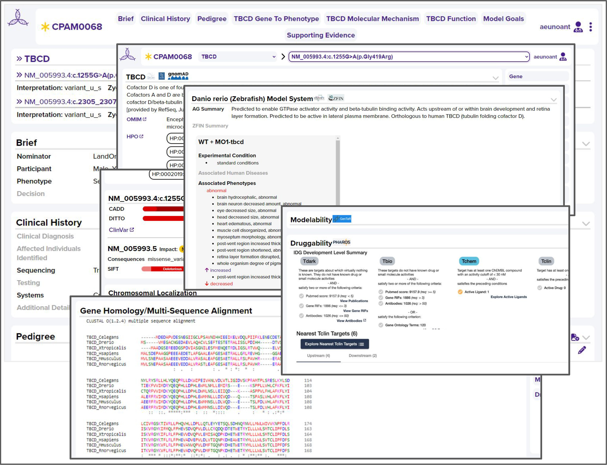

# Summary

One in ten individuals lives with a rare genetic disease; ~50% are children. Recent advances have revolutionized our
ability to identify candidate and confirmed causal molecular changes (variants). Hundreds of thousands of variants now
await functional confirmation. A major bottleneck is the need for characterization of these variants to: generate
definitive diagnoses, aid in understanding of pathogenic mechanisms, guide the development of accurate predictive
models, and refine existing or suggest new therapeutic approaches. Rosalution is an open-source full-stack web
application developed by the software engineering team within the University of Alabama at Birmingham (UAB) Center
for Precision Animal Modeling (C-PAM) to support collaboration between researchers and physicians working on modeling
rare disease in animal models. The mission of the UAB C-PAM is to provide a national modeling service to aid patients,
researchers, and physicians in diagnosing and treating rare genetic diseases. The models, materials, tools, and data
generated are made available to the collaborators who nominated the candidate variant of interest (nominator) and the
broader research and clinical community. Rosalution streamlines data collection, quality control, standardization, and
integration. It also supports the analysis process, guiding and collecting the decisions made during case and variant
consideration. It is designed not only to facilitate analysis and generation of biological insights for an
individual case, but also aims to enrich subsequent data mining and process improvement for meta-analyses.

# State of the field

​​Precision animal modeling involves creating genetically engineered animals with specific molecular alterations
identified in human diseases, such as cancer, neurodegenerative disorders, and cardiovascular conditions. The models
generated serve as invaluable tools for molecular diagnostics, biomedical research, and drug development in particular.
Over recent years, advances in molecular biology, cell biology, and computational methodologies have increased
applications for these models. Widespread adoption of whole exome and genome sequencing has accelerated the
identification of disease genes and rare disease-causing variations. Advanced algorithms and software have streamlined
data analysis, helping researchers filter out common genetic variants and prioritize rare, potentially disease-causing
ones. CRISPR-Cas9 technology has made precise genetic alterations in animals more accessible. Collectively, these
advancements have revolutionized our ability to identify and understand molecular variations underlying human diseases,
greatly enhanced our knowledge of biological processes and disease mechanisms, and empowered us to test therapies and
drugs using precision animal models.

Selecting the right variants for precision animal models often involves reviewing research publications and, in some
cases, employing custom scripts and pipelines to integrate data from various sources. These datasets and tools
encompass variant annotation software like ANNOVAR, Variant Effect Predictor (VEP) [@mclaren_ensembl_2016], or SnpEff,
which provide crucial information about variant location, functional impact, and potential disease associations.
Variant allele frequency and disease association repositories like ClinVar [@landrum_clinvar_2018], ExAC, and gnomAD
offer insights into variant prevalence in the general population and their links to diseases. Damage prediction
algorithms like VAAST, PolyPhen-2 [@adzhubei_method_2010], and SIFT [@ng_predicting_2001] aid in predicting variant
pathogenicity based on sequence conservation, functional impact, and population frequencies. Rare disease collaborative
databases and platforms are also valuable resources for variant selection and interpretation.

While the development of pipelines and tools for precision animal modeling requires significant effort, there's a
notable tool called MARRVEL (Model organism Aggregated Resources for Rare Variant ExpLoration) designed to assist
users in exploring data from these repositories for variant consideration. MARRVEL provides a wealth of curated
information about human genes and variants, along with their orthologous genes in seven model organisms. It aids in
assessing whether a variant of unknown significance (VUS) in a known disease-causing gene or a variant in a gene of
uncertain significance (GUS) might be pathogenic. The tool aggregates data from various sources, including
OMIM [@amberger_omimorg_2015], ExAC/gnomAD, ClinVar [@landrum_clinvar_2018], Geno2MP, DGV, and DECIPHER, and
offers insights into orthologous genes, expression patterns, and Gene Ontology (GO) terms across both human and
model organisms.

Although MARRVEL provides extensive, carefully selected, and organized information, it doesn't currently support direct
user curation or annotation. Nevertheless, the ability to curate data, as seen in platforms like Rosalution, offers
numerous advantages. It encourages collaboration and knowledge sharing within the scientific community, driving
researchers and experts to contribute insights and annotations. User-curated data enables rapid integration of new
research findings, maintains standardized data representation, and reduces the likelihood of errors or
misinterpretations. As precision medicine and animal modeling continue to advance, user-curated data plays a vital
role in staying at the forefront of scientific discovery.

# Statement of Need

Gene editing approaches are used to generate precision disease animal models (e.g., cells, worms, zebrafish)
carrying patient derived variants. Understanding the specific cellular and molecular impact of these variants in
such model systems support the efforts to derive, diagnose, and provide therapies for ultra-rare diseases. Generating
these models can take months to years.

The process of vetting candidate variants is generally a manual, non-systematic, and inefficient process, performed
using different methods and datasets generated or curated by hundreds of cell and molecular biology labs worldwide.
Researchers invest many hours gathering data and reviewing candidates using a series of disparate tools. Project
tracking that collected information and any additional generated data are rarely available in an accessible and
structured format. Criteria used in decision-making often need to be better standardized, validated, or tested.
Both ingested and generated data and metadata are often incompletely retained and thus lost for reuse. We developed
Rosalution to centralize these collaborative efforts via an accessible website client and application programming
interface (API). A design-first approach was selected and focused on creating a seamless experience that guides
teams through a collaborative analysis process keeping functionality and accessibility in mind. The Rosalution web
client implements this design as a VueJS single-page architecture (SPA) website and a FastAPI Python service enabling
programmatic access following the OpenAPI standard, which deploys interactive API documentation. Rosalution
persistently stores its state in a MongoDB NoSQL database.

Rosalution facilitates three aspects of the case review process:

- Augmenting and standardizing case and variant/gene intake and annotation with configurable automated annotation from
  publicly available data sources \autoref{tbl:datasources}
- Supporting expert curation by clinical and research experts via a web-based interface
- Supporting synchronous and asynchronous collaborative review by interdisciplinary teams via a web-based interface

# Analysis Intake

New cases in Rosalution are uploaded as a JSON file either via the web client user interface (UI) or web API. The data
for analysis is structured programmatically from a predefined template populated with data from the uploaded JSON.
Once the new case persists in the database, the API sends an HTTP response noting successful creation. Researchers
then begin preparing the case within the Rosalution web client with additional insights and supporting evidence, as
seen in \autoref{fig:analysis}. In the background, the Rosalution API queues an annotation task for each dataset
associated with the case's variants, genes of interest, and clinical data. These annotation tasks are processed in an
external thread pool to not block incoming HTTP traffic to Rosalution's API, keeping the application free to use while
performing annotation in the background. An abstract Python class defines annotation tasks with an interface for
subclasses to implement reading datasets from a specified data source. Once fetched, the data is returned to a Python
dictionary to be extracted and saved in the database using the `jq` Python module. The application provides the `jq`
module with the query to extract the dataset's value as defined in the configuration of the annotation task. This
design supports simul annotating from a variety of disparate sources of REST APIs and databases referenced in
\autoref{tbl:datasources}, with planned support in the future of variant call format (VCF) files, databases, etc.

------------------------------------------------------------------------------------------------------------------------
Data Sources/Tools                                            Usage          Datasets
------------------------------------------------------------- -------------- -------------------------------------------
Alliance Genome                                               REST API       Gene Summary, (Mouse-Mus musculus, Rat-  
[@alliance_of_genome_resources_consortium_harmonizing_2022]   and Database   Rattus norvegicus, Zebrafish-  
                                                                             Danio rerio, Worms - C-Elegens) Gene Id
                                                                             and Gene Synopsis

ClinVar                                                       Database       Interpreted Conditions and  
[@landrum_clinvar_2018]                                                      Interpretation

Entrez Gene                                                   Database       Entrez Gene Id
[@maglott_entrez_2007]

Ensembl Data                                                  Database,       Ensembl Gene Id, Consequences, Impact,  
[@zerbino_ensembl_2018],                                      REST API,       Polyphen Prediction and Score  
Ensembl REST API                                              Tool via        [@adzhubei_method_2010], ClinVar Ids,  
[@yates_ensembl_2015],                                        REST API        RefSeq Transcript Id  
Ensembl VEP                                                                   [@oleary_reference_2016],  
[@mclaren_ensembl_2016]                                                       SIFT Prediction and Score  
                                                                              [@ng_predicting_2001], CADD  
                                                                              [@rentzsch_cadd-spliceimproving_2021]

HUGO Gene Nomenclature Committee (HGNC)                       Database       HGNC Gene Id
[@seal_genenamesorg_2023]

Human Phenotype Ontology (HPO)                                REST API and   Entrez Gene Id, OMIM,  
[@kohler_human_2021]                                          Database       Disease Associations,  
                                                                             HPO Term Association  

Online Mendelian Inheritance in Man (OMIM)                    Database       OMIM, Disease Associations
[@amberger_omimorg_2015]                                      Database       Disease Associations,
------------------------------------------------------------------------------------------------------------------------

Table: Data Sources and Tools utilized for Gene and Variant Annotations \label{tbl:datasources}

# Collaborative Analysis

Within the UI, Rosalution displays a summary of the case (gene, variant, nominator, and unique ID) as a case card. A
subset of recent case cards shows along with a search bar. Selection of a case opens the case record. The web client
splits data in the record into two sections.  The case section shows clinical and case specific genetic information,
including age, sex, onset, literature evidence, variant data/interpretations, disease and phenotype associations, prior
testing, and clinical utility statements.

Genes and variants of interest are presented at the top of the record as seen in \autoref{fig:annotations}. Clicking on
either the gene or variant renders its annotations. Variant-specific data, including pathogenicity, allele frequency,
impact, druggability, functional associations, and cellular context are presented.

When displaying annotations, the web client queries the web API for a configuration stored in the database that
determines how annotations are displayed. By investing in implementation of a configurable visual rendering we can
rapidly adjust the data representation based on how the users are using the data.

A research team member is assigned to review and add any pertinent annotations from the patient records. The
application's web client interacts with the web API to persist the changes. Once the case is open and assigned for
analysis additional collaborators can further curate by adding additional supporting evidence and files as they
review the case prior to the review meeting. Curating is done by attaching hyperlinks to online resources or files
supplemented with comments. During review meetings, when the entire assigned team seeks to decide on the nomination,
any novel data used to make decisions are attached to the case as part of the review process. This way, all expert
curations and important datasets integrate into a case within a single repository as a compilation of data and
visuals added.

# Conclusion

In conclusion, Rosalution is an open source tool for facilitating collaborative analysis for model generation in the
rare genetic disease research community. It supports the process of animal modeling from case intake to decision
making. Benefits of this platform include (1) more efficient data analysis through aggregation and automated annotation
as well as support for both synchronous and asynchronous collaboration, (2) a reduction in errors via a focus on
increasing data standardization and reducing knowledge loss by supporting the real-time collection of curations and
evidence via a web-based user interface and API, and (3)  an increase in data sharing with its focus on ability to
data mine across all records. Rosalution shows potential for growth and scalability as it opens its development to
the broader open-source and open-science communities.

# Acknowledgments

We are thankful for the collaborative insights and generous sharing of expertise from all members of C-PAM. This work
was supported by NIH 1U54OD030167-01 to Dr. Worthey for the C-PAM - Bioinformatics Section. Additional funding for
this project was provided as start-up funds to Dr. Worthey from UAB.

# References
